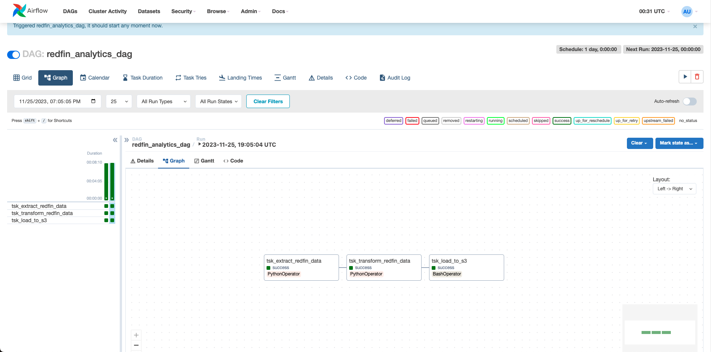
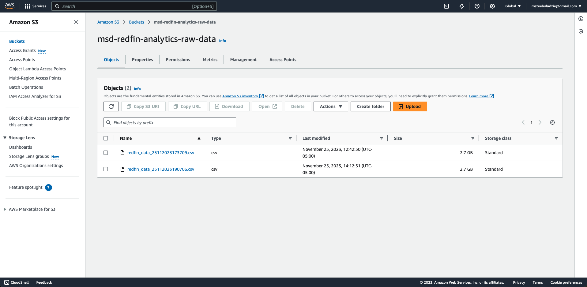
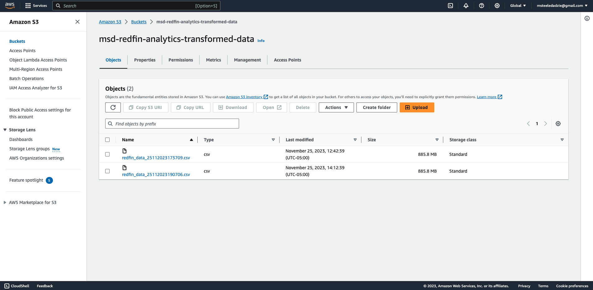
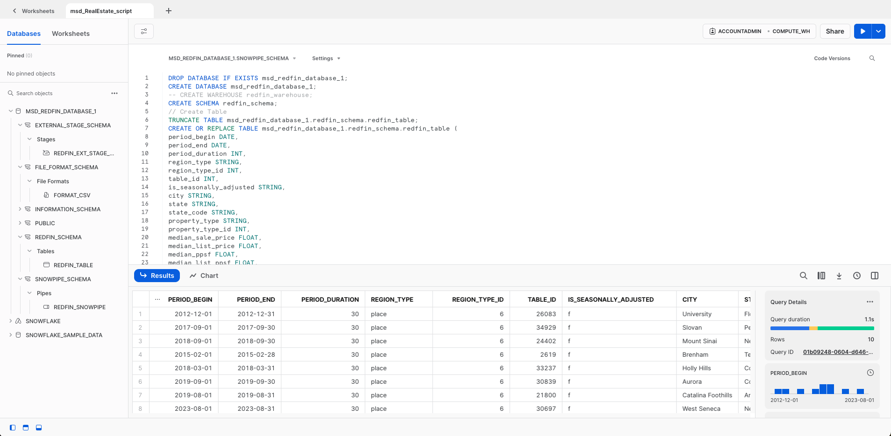

# Redfin City Real Estate Data Pipeline

This is an ETL data engineering project that uses Apache Airflow, Snowpipe, Snowflake, and AWS Services to extract real estate data from Redfin.
Using Airflow hosted on an AWS EC2 Instance, raw Redfin data is pulled into an AWS S3 bucket, transformed and loaded into another AWS S3 bucket before ultimately being loaded into a Snowflake data warehouse via Snowpipe.

Project composed with aid from tutorial ["Redfin Analytics|python ETL pipeline with airflow|Data Engineering Project|Snowpipe|Snowflake"](https://www.youtube.com/watch?v=NWZrBEnJ6Us) by Yemi Olani.

### Airflow DAG Graph

### AWS S3 Buckets

### Snowflake Data Warehouse Creation

